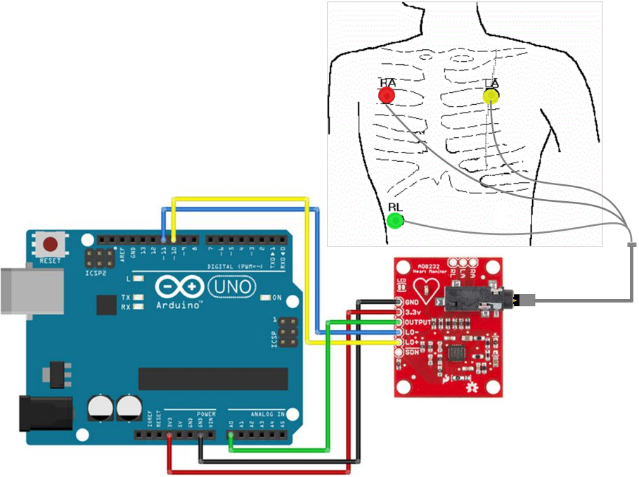

---
tags:
  - IoMT
---
## **ECG y Arritmias (AD8232)**

>[!info] Fase del Plan de Trabajo
>[FASE 1 - MODELOS EN PC](../../00_PLAN/FASE%201%20-%20MODELOS%20EN%20PC.md), [FASE 3 - SENSORES FÍSICOS](../../00_PLAN/FASE%203%20-%20SENSORES%20FÍSICOS.md) y [FASE 4 - SISTEMA MULTIAGENTE](../../00_PLAN/FASE%204%20-%20SISTEMA%20MULTIAGENTE.md)

El módulo AD8232 es un sensor analógico diseñado para medir la actividad eléctrica del corazón y capturar biopotenciales cardíacos, centrándose en este prototipo en la derivación II (Lead II) del [electrocardiograma (ECG](../Medicina/Electrocardiograma%20%28ECG%20o%20EKG%29.md)). Al generar señales analógicas muy delicadas y sensibles al ruido eléctrico del entorno, requiere el uso de un conversor analógico a digital (ADC), como el integrado en el microcontrolador ESP32 o un conversor externo (MCP3008), para poder procesar la información correctamente.

Los datos obtenidos por este sensor son analizados por el "Módulo B", el cual emplea la red TinyECGNet Sequential ([1D-CNN](Redes%201D-CNN.md) separable ultraligera, 2 673 parámetros) entrenada con la base de datos "PTB-XL" (Lead II, 250 Hz, 10 s) para clasificación binaria NORMAL/ANORMAL. En la lógica de triaje cooperativo, el Agente de ECG provee un contexto hemodinámico crucial; su información permite validar emergencias graves al combinarse con otros agentes (como confirmar un síncope si hay hipotensión asociada), o descartar anomalías si un pulso elevado corresponde simplemente a un estado de actividad física normal verificado por el acelerómetro.

#### Links
* **PTB-XL (dataset oficial Módulo B):** Base de electrocardiografía clínica con 20 970 ECG utilizables (Lead II, 250 Hz, 10 s) tras filtros de edad y etiqueta binaria NORMAL/ANORMAL. Con ella se entrenó TinyECGNet Sequential (Keras Acc 0.7894 / INT8 Acc 0.7960 en TEST).
	* https://physionet.org/content/ptb-xl/1.0.3/
	* https://www.kaggle.com/datasets/khyeh0719/ptb-xl-dataset/code

---
